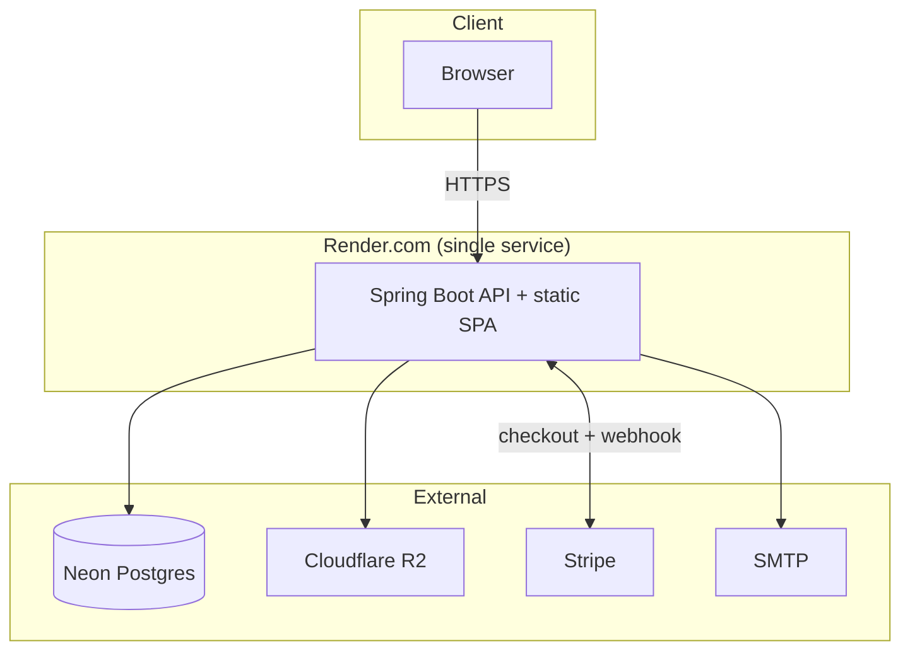
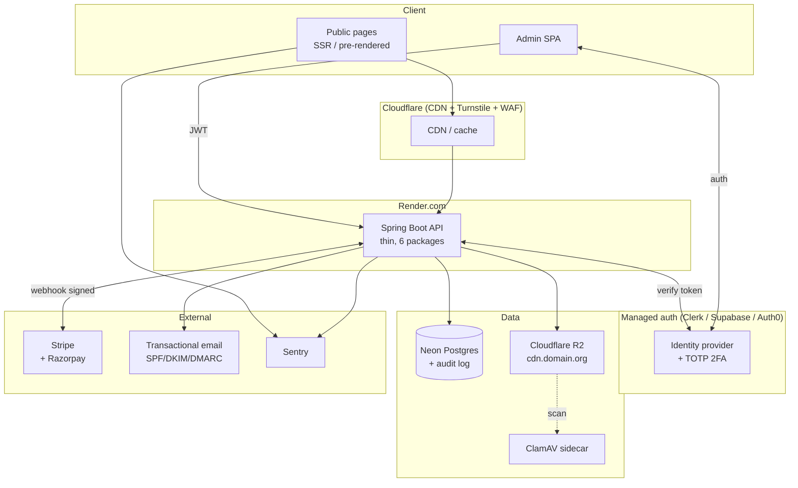

# Foundation NGO — Architecture & Security Review

_Independent recommendations for simplifying the codebase, hardening security, and strengthening the product._

_Date: 2026-04-15_

---

## What to optimize for

You have a donation site with real money flowing through it, an admin CMS, and one primary developer. The right optimization target is **"boring and auditable"** — minimize moving parts, make the security story explicit, and ruthlessly delete anything that isn't earning its keep. Every package, every doc file, every feature flag is future maintenance.

---

## 1. A simpler architecture — keep Spring Boot, cut aggressively

I would **not** rewrite. The backend works. Do this instead.

### 1.1 Collapse backend packages (23 → 6)

Today you have separate packages for `hero`, `home`, `footer`, `contact`, `settings`, `cms`, `stats`. From one user's perspective those are all "site content." A healthier layout:

```
com.myfoundation.school
├── auth         // login, JWT, password reset, 2FA
├── donations    // Stripe, receipts, webhooks, admin list
├── campaigns    // campaign CRUD + spotlight
├── content      // hero, home, footer, contact, CMS, site-settings
├── platform     // shared: config, security, exceptions, audit, logging, storage, email
└── admin        // admin-only endpoints; thin controllers calling the above
```

Feature slicing is good. You've sliced too thin. A new developer should find "where do campaigns live" without ambiguity.

### 1.2 Stop inventing auth

Replace hand-rolled JWT with either:

- **Spring Security + Spring Authorization Server** (keep everything in-house), or
- A managed provider — **Supabase Auth**, **Clerk**, or **Auth0** (free tiers cover you).

You get built-in password reset, 2FA/TOTP, session management, rate-limited login, breach-password detection, SOC2-audited primitives. You focus on donations, not auth plumbing.

### 1.3 One source of truth for docs

Move all 60+ `PHASE*` / `SUMMARY` / `AUDIT` markdown files into `docs/archive/` and replace with:

- `docs/README.md` — current state, how to run
- `docs/adr/` — Architecture Decision Records, one per decision, dated
- `docs/runbook.md` — what to do when things break at 2am

### 1.4 Add SSR for public pages

Campaign pages need SEO. Google rewards server-rendered content; a campaign that doesn't rank on "donate to [cause]" is leaving money on the table. Options, cheapest first:

1. **Pre-render campaign pages at build time** with `vite-plugin-ssr` or `react-snap`. A weekend of work.
2. Wrap the public site in **Next.js** (App Router), keep Spring Boot as the API. Admin stays SPA. A month of work.
3. Stay SPA and pre-render with `react-snap` — simplest, limited flexibility.

Start with option 1.

### 1.5 Feature flags — a table, not a vendor

Don't introduce LaunchDarkly. A `feature_flags` table with a 60s in-memory cache is enough for your scale.

---

## 2. Security — world-class checklist

### 2.1 Payment path (highest blast radius)

- Verify Stripe webhook signatures with `Webhook.constructEvent(payload, sig, secret)` — not string compare.
- **Idempotency keys** on donation creation so a double-click never double-charges.
- Never log full card data, BIN, or payment method IDs in plaintext.
- Server-side amount validation — reject amounts your frontend wouldn't have sent (e.g., < ₹10, > ₹10,00,000 without admin approval).
- **Cloudflare Turnstile** CAPTCHA on the donation form — free, privacy-respecting, better than reCAPTCHA.

### 2.2 Admin surface

- **2FA (TOTP) on every admin account**, enforced, not optional.
- **Argon2id** for password hashing, not bcrypt — if you're still on plain bcrypt, upgrade.
- Optional IP allowlist for admin routes if admins work from fixed offices — a single Spring Security rule.
- Short access-token TTL (15 min) + refresh-token rotation.
- Admin actions write to `audit_log` with actor, IP, before/after diff.

### 2.3 Web security headers

Add one `@Configuration` class that sets:

- `Strict-Transport-Security` — HSTS, 1 year, preload
- `Content-Security-Policy` — nonce-based, no `unsafe-inline`
- `X-Frame-Options: DENY`
- `X-Content-Type-Options: nosniff`
- `Referrer-Policy: strict-origin-when-cross-origin`
- `Permissions-Policy` locking down geolocation/camera/microphone

### 2.4 File uploads to R2

- Validate by **magic bytes**, not extension — `.jpg` can hide a PHP shell.
- Enforce max file size at both app level and at the R2 presigned URL.
- Scan uploads with **ClamAV** (free, runs as a sidecar).
- **Strip EXIF metadata** from uploaded photos — donor photos leak GPS coordinates.
- Serve uploaded files from a different subdomain (`cdn.yourdomain.org`) so XSS on uploads can't reach auth cookies.

### 2.5 Data & secrets

- Secrets live in Render's env panel, never in git history. **Rotate anything ever committed.**
- Consider application-level encryption with a KMS for PII columns (donor name, email, phone) if Neon's native options don't fit.
- **Backups tested monthly** — an untested backup is not a backup. Calendar it.
- Enable **GitHub Dependabot** (free) + **CodeQL** on your repo. Snyk if you want deeper scanning.
- **Rate limiting** with **Bucket4j** on login, donation-create, and contact-form endpoints. Different buckets per IP and per endpoint.

### 2.6 Compliance (India-specific — Razorpay is on the roadmap)

- **80G tax receipts** — donors need a PDF receipt for tax deduction. A donation feature, not nice-to-have.
- **FCRA** — if accepting foreign donations, needs registration and a separate bank account; the site must route foreign donations to the FCRA account. Your current Stripe flow probably commingles.
- **DPDP Act 2023** — India's new data protection law requires a privacy policy, purpose limitation, a "delete my data" flow, and explicit consent at the form level.
- **PAN capture** — donations above ₹2,000 legally require donor PAN for 80G.

---

## 3. Things you're probably not thinking about

- **Recurring giving is the highest-LTV donation.** A monthly ₹500 donor beats a one-time ₹5,000 donor in 18 months and churns less. Add a "Donate monthly" toggle — Stripe Subscriptions handles it.
- **Donor dashboard.** Passwordless magic-link login; donors see history, download receipts, update card, pause/resume. Cuts support load dramatically.
- **Trust signals on the homepage.** NGO registration number, 80G certificate image, audited annual report PDF, photos with names and consent. Donors inspect these before giving.
- **Impact transparency.** Per-campaign page showing "₹X raised → spent on Y → photos of Z." Update quarterly. Biggest driver of repeat donations.
- **Email deliverability.** Verify SPF, DKIM, DMARC records for your sending domain. Receipt emails going to spam triggers refund requests.
- **Observability beyond logs.** Free tier of **Sentry** for frontend + backend errors, **Better Uptime** / **UptimeRobot** for monitoring, **Plausible** or **Umami** for privacy-respecting analytics (not GA).
- **Staging environment.** Separate Render service + separate Neon branch. Never test in prod with real Stripe.
- **Accessibility (WCAG 2.1 AA).** Screen-reader-friendly donation flow, keyboard nav, colour contrast ≥ 4.5:1, form labels. NGO sites face audit and litigation risk in some jurisdictions.
- **Performance budget.** Target LCP < 2.5s, CLS < 0.1, INP < 200ms. Your `stats.html` shows you already have the Vite bundle visualizer — set a CI budget.
- **Refund policy + offline donations.** A donor asks for a refund, or gives a cheque. The system needs a workflow.
- **Corporate / CSR donations.** Indian companies with >₹5 Cr profit must spend 2% on CSR. A "for companies" page with FCRA/80G details captures large cheques.
- **Annual report as a feature.** A live web page with totals, breakdowns, and stories — not a PDF in a drawer.

---

## 4. Architecture diagrams

### 4.1 Current state



### 4.2 Proposed state



---

## 5. Suggested prioritization

Rough order of effort-vs-impact:

1. **This sprint:** security headers config, idempotency keys on donations, Turnstile on donation form, Dependabot + CodeQL enabled, remove duplicate `CapimanInfra` folder, move progress docs to `docs/archive/`.
2. **Next sprint:** 2FA for admins, Argon2id migration, staging environment, Sentry wired up, SPF/DKIM/DMARC for email domain.
3. **Following month:** recurring donations, donor dashboard with magic-link auth, 80G receipt PDF, pre-rendered campaign pages for SEO.
4. **When scope allows:** package consolidation (23 → 6), managed auth migration, impact-transparency page, CSR landing page.

---

## 6. Open questions for you

- Is the foundation **80G registered**? Does it accept **foreign donations** (FCRA)?
- What's the **current donor retention rate** — do you know how many give more than once?
- Who uses the admin panel today — one person, or a team? Affects auth choices.
- Is there a **staging environment** currently?
- What's the **primary traffic source** — organic search, direct, social, paid? Drives the SEO investment case.
